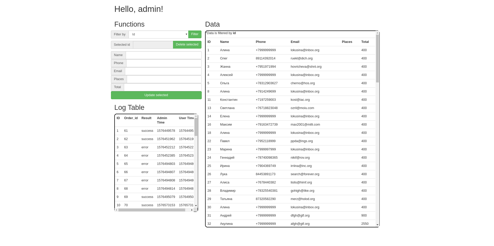

# Inno Cinema

## How to run (Ubuntu 19.04):

1. Install php and apache2

2. Run in terminal `sudo systemctl restart apache2.service`

3. Open this link in your browser: `http://localhost/InnoWeb/index.php`

## Проедварительный просмор:

### Main page

[Demo video](./media/demo.mp4)

### Admin page

## ТЗ :

> Изначальня версия ТЗ, без изменений внесённых во время курса, находится в папке "./media"

-   [x] При посещении лэндинга автоматически определяется регион пользователя и выводится в шапке сайта
-   [x] На маркетинговом блоке размещены три круглых элемента-иконки с подписью (преимущества кинотеатра)
-   [x] При передвижении мышью над преимуществом — иконка реагирует с использованием анимации
-   [x] Одно из преимуществ имеет отношение к интерьеру кинотеатра. При наведении на него мышью всплывает подсказка - «нажми меня, чтобы увидеть интерьер»
-   [x] После нажатия на преимущество всплывает галерея с фотографиями кинотеатра
-   [x] В блоке со списком фильмов (таблица) предусмотрены колонки: чекбокс (отметить), изображение, наименование, год выпуска, описание
-   [x] Пользователь может сортировать и фильтровать таблицу по наименованию фильма и времени показа
-   [x] Пользователь отмечает в таблице фильм и вызывает форму обратной связи для оформления билетов на него
-   [x] Особое внимание уделить адекватному отображению таблицы с фильмами при отображении на мобильных устройствах:
        ◦ скрытие колонок «описание» и «год выпуска» на экранах менее 720px
        ◦ горизонтальная прокрутка таблицы на экранах менее 480px
-   [x] Форма обратной связи представляет из себя всплывающий pop-up с полями: наименование фильма (подтягивается в соответствии с выбором в таблице), имя, e-mail, загрузка купона на скидку (файла);
-   [x] динамический блок с возможностью добавления строк: ряд (селект), место(селект) билета
-   [x] На данной стадии реализации проекта не предусмотрена проверка ранее заказанных мест. Позволяем пользователям заказывать все места
-   [x] После заполенения и отправки формы пользователю приходит письмо с благодарностью о совершенном заказе и забронированном месте. Администратору приходит письмо-уведомление
-   [x] Для административной области лэндинг пэйдж выделен отдельный URL
-   [x] Поступающие от пользователей заявки сохраняются в базу данных
-   [x] Администратор сайта может просматривать / редактировать / удалять сохраненные заявки
-   [x] На данной стадии реализации проекта не предусмотрен раздел авторизации для административной области лэндинг-пэйдж
-   [x] Отправка писем реализована с помощью php mail
-   [x] База данных SQLlite3
-   [x] Для доступа к базе данных используется расширение для PHP - PDO
-   [x] Запросы к базе данных на вставку или редактирование данных должны быть экранированы с использованием prepare statements
-   [x] Информационный блок расположения кинотеатра (карта) выполнен с ипользованием сервиса Яндекс.Карты
-   [x] Для опеределения геолокации используется внешний ресурс сервиса Яндекс.Карт, работающий в соответствии с REST:
        https://tech.yandex.ru/maps/jsapi/doc/2.1/ref/reference/geolocation-docpage/
-   [x] Дизайн лэндинг-пэйдж соответствует дизайну, предоставленному заказчиком (преподавателем) в формате \*.psd Дизайн может быть измененён по взаимному соглашению с заказчиком ( консультантом курса )
-   [x] Вёрстка лэндинг-пэйдж корректно отображается в современных desktop браузерах: Google Chrome, Mozilla Firefox, Safari, Edge (последние верcии )
-   [x] Вёрстка лэндинг-пэйдж корректно отображается в современных мобильных браузерах: iOS Safari, Chrome for Android (последние версии)
-   [x] Вёрстка адаптивная с применением методологии БЭМ, на flex элементах и CSS grid. Возможно использование фреймворка Bootstrap4
-   [x] Вёрстка лэндинга осуществляется итеративно:
        ◦ сначала фиксированная верстка
        ◦ переделывается на резиновую
        ◦ переделывается на адаптивную с испозованием media-jQuery
-   [x] Так же используется итеративный подход с точки зрения применения разных подходов к верстке:
        ◦ 1-я итерация: шапка — float, маркетинговый блок — блочная, подвал —
        CSS grid
        ◦ 2-я итерация: float и блочная верстка переделываются на flex
-   [x] Там, где это возможно, валидация полей формы обратной связи осуществляется стандартными средствами HTML5. Анимация, где возможно, должна быть реализована средствами CSS3
-   [x] Интерактивное взаимодействие с пользователем (всплытие окна, другая анимация, нереализуемая средствами CSS3 ) - с использованием JavaScript и библиотеки jQuery
-   [x] Для вывода списков фильмов используется внешний ресурс, работающий в соответствии с REST: https://www.themoviedb.org/documentation/api/discover ( endpoint: /discover/movie?sort_by=popularity.desc )
-   [x] Серверная часть реализована с использованием языка программирования PHP 7.2, без использования фреймворков.
-   [x] Обязательно использование языковых средств JavaScript из стандарта ES6.
-   [x] Кодовая база JavaScript реализуется в два этапа:
        ◦ без использования возможностей ES6
        ◦ переписывается с поддержкой ES6 + подключение babel.js
-   [x] # Обязательно следование рекомендациям преподавателя и консультантов по стилю оформления кода (именование функций, переменных, классов, методов) и структуре кода ( ООП, отсутсвие дублирования, логическая пофайловая разбивка проекта и именование файлов )
